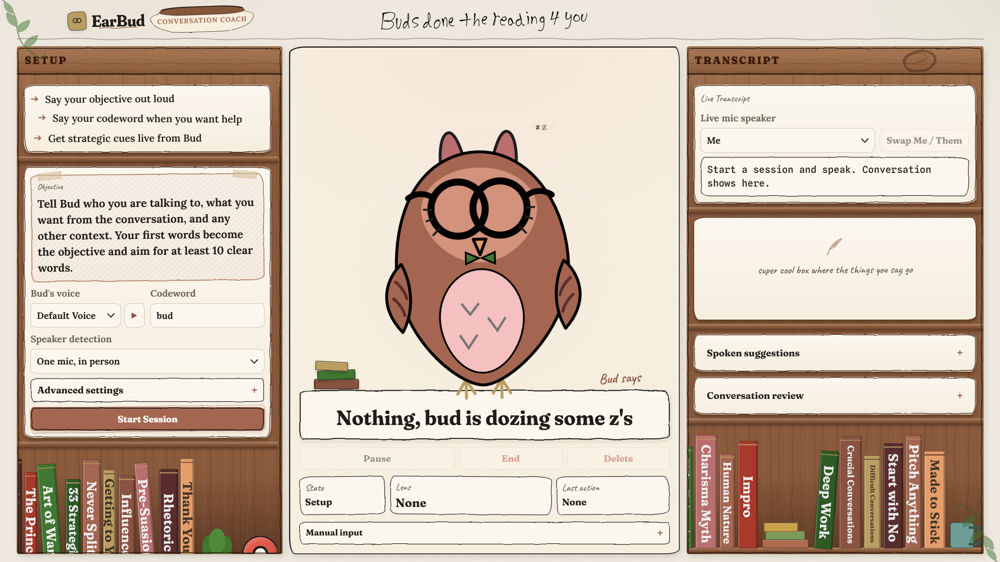
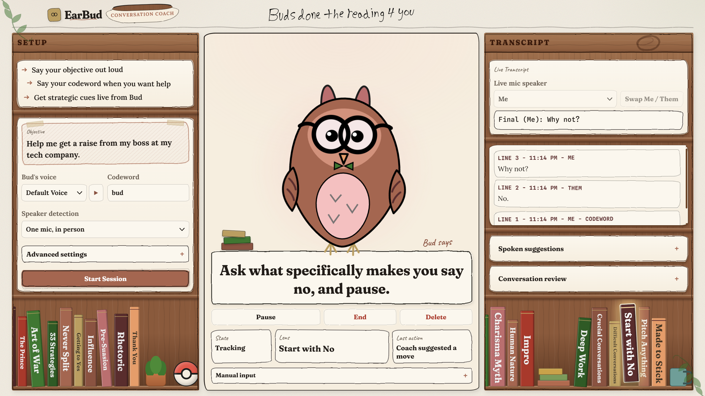

# EarBud

EarBud is your personal coach who discreetly guides your speech and helps you toward your objective during your conversations. It is a browser-based application that can run on both phone and desktop.

Before speaking to Bud, your personal coach, you can choose your codeword, conversation type, Bud's suggestions, and even Bud's voice. Next, connect your earbuds or wireless audio device, start a session, and speak your objective to Bud who will listen to it and give guidance based on it. Say your codeword when you want help, and Bud will chime in and give suggestions based on the current conversation history and your objective.

EarBud is for all people, whether you are a student or a working professional. EarBud is there for all conversational tasks such as asking for a grade bump, pitching an idea to an investor, or making plans and forming bonds with those around you, as everyone forgets things and could use a coach on their side. EarBud leaves you free to focus on what matters, getting your ideas across and achieving your goals.

---

## Motivation

Imagine this, you're talking to your boss about a crucially needed raise. You explain why you want the raise and how it would help you. Your boss then asks why you should get this raise. Your mind goes blank, and you don't get the raise. With Bud on your side, he would have suggested you name a specific accomplishment you have recently done and how it benefited the company. You get the raise!!

Earbuds, fast hardware, and models that can finally reason in real time make a coach like Bud possible.

Nothing out there does what Bud does. Notes are not live and summaries can only look backwards. Bud incorporates live notes in a discreet manner.

---

## Screenshots & Demo

**Demo video** (click to play on YouTube)

[](https://youtu.be/rTaatdKDSN4)

**Bud waiting for a session**




**A live suggestion**





---

## Features

Bud has all the features you'd expect from a coach:
- live feedback
- real time voice diarization Me/Them
- video call mode with diarization
- advice tailored for the user based on the conversation context
- gives easy to say and effective advice

---

## How Do Sessions Work

Before a session starts, you can set a few things:

- Bud's response vs. reasoning levels
- Bud's spoken suggestion voice, speed, and volume
- the type of conversation
- a codeword to trigger coaching

When the session begins you say your objective out loud. EarBud uses those first words two ways. It reads them as your goal, and it uses your voice to calibrate so it can tell you apart from the other speakers.
 
When you start the conversation, you can just say your codeword whenever you want help. Bud reads the whole conversation so far and tells you your best next move. Say the codeword again to pause coaching.

Each new line of transcript can trigger a call to the backend model. The server builds a prompt from your objective, the codeword, and the last 16 lines of the labeled transcript, then asks OpenAI for the next move. The model replies in a JSON that contains the response and other things the model used to get the suggestion. 

A suggestion might be:

> "Mention a specific flavor which makes your hotdog special"

The suggestions are designed to be under 15 words and concise so that you can easily incorporate them into a conversation. 

If the OpenAI call fails, the server falls back to a simple local suggestion built in `coachLogic.js` so the session keeps running.

After a session ends, Bud sends the transcript back to OpenAI for a recap. The review comes back as (Achieved, Partially achieved, Not achieved, or Inconclusive), a short summary, and three short lists that cover what worked, what to improve, and next steps. Since Bud is not dealing with live conversation, he can have more time to reason for a complex and nuanced answer.

---

## How Does Coaching Work

The coaching lives in `coachingPrinciples.js`, which contains sources on persuasion, negotiation, and communication tactics.

The tactics are taken from sources like:

- *Never Split the Difference*
- *Influence*
- *The Art of War*
- *The 48 Laws of Power*
- *Aristotle's Rhetoric*

Each source contains a short label which describes the situations it is best used for. The full library is sent in the coach prompt, and for each suggestion the model picks the single most relevant tactic and names it in the `lens` field. The tactics just shape the advice, so the model never quotes or imitates book text.

If the objective involves harming, defrauding, or exploiting anyone, EarBud redirects instead of helping. Bud is also told to stay truthful and to not make up facts or lie. He is also told to only advise **Me**, never the other person.

---

## Tech Stack

EarBud is a small Node.js app that runs both the website and everything behind it.

The app itself is just plain JavaScript, HTML, and CSS. It listens to your audio in the browser and streams it out live as you talk.

AssemblyAI listens and turns the speech into text, figuring out who said what. Bud's coaching is powered by OpenAI. Bud constantly sends prompts that contain the transcript, objective, and sources which guide the advice (Art of War, 48 Laws of Power). If you don't have an AssemblyAI key, it falls back to your browser's built-in speech recognition so you can still try it out.

The whole thing runs on Render as a single service, and it stays connected for your entire session so the live coaching never drops out.

---

## Transcription Modes

Each session runs in one of three modes.

### In Person (single microphone)

One microphone picks up everyone in the room, and AssemblyAI's speaker diarization works out who is talking.

The first voice it hears is labeled **Me** and everyone else is labeled **Them**. If the labels come out backwards you can just swap them.

This mode works best with AirPods or other clip on mics, where a single device hears the whole conversation. Extra turn taking logic in `coachLogic.js` and `sessionLogic.js` helps with short replies that are hard to attribute the speaker to. The server also tunes AssemblyAI's diarization logic, so it's better at catching full phrases and not cutting them off.

### Online Calls

For virtual meetings your microphone is **Me** and the system audio or a shared browser tab is **Them**.

Each source is already separate, so there is one WebSocket per source and diarization is turned off as it is unnecessary.

### Manual Mode

You can type in the speech lines yourself and change who is speaking with the dropdown menu.

This one is useful for testing and development, and it works with no AssemblyAI key set as it does not need diarization or transcription.

---

## Running Locally

Install dependencies:

```powershell
npm install
```

Copy `.env.example` to `.env` and add your keys:

- `OPENAI_API_KEY` powers the coaching and the review.
- `ASSEMBLYAI_API_KEY` powers live transcription.

Get API keys from:

- https://platform.openai.com/api-keys
- https://www.assemblyai.com/app

Start the app:

```powershell
npm start
```

Then open:

```text
http://localhost:3000
```

For development with auto reload on file changes:

```powershell
npm run dev
```

To run the tests:

```powershell
npm test
```

If you start it with no `OPENAI_API_KEY` then Bud is disabled. No `ASSEMBLYAI_API_KEY` also means live transcription is disabled, but you can still use manual mode to input dialogue.

---

## Configuration

All settings are read from the environment (use `.env` locally). The model and reasoning effort can also be changed from the UI during a session.

---

## Deploying on Render

The repo includes a `render.yaml`, so the whole app deploys as a single Render service. The Node server hosts both the frontend and the backend, so there is no separate static host to set up.

Steps:
1. push the repo to GitHub, GitLab, or Bitbucket
2. create a new Render blueprint from the repo
3. add your `OPENAI_API_KEY` and `ASSEMBLYAI_API_KEY`
4. deploy, that's it 

The service:
- builds with `npm ci`
- starts with `npm start`
- runs on Node 22
- uses `/api/health` for health checks
- picks up the `PORT` Render provides

The free tier is fine for demos. It sleeps when idle, so the first visit after a while takes a few seconds to wake up.

---

> Built with the help of Claude Code and Codex.

