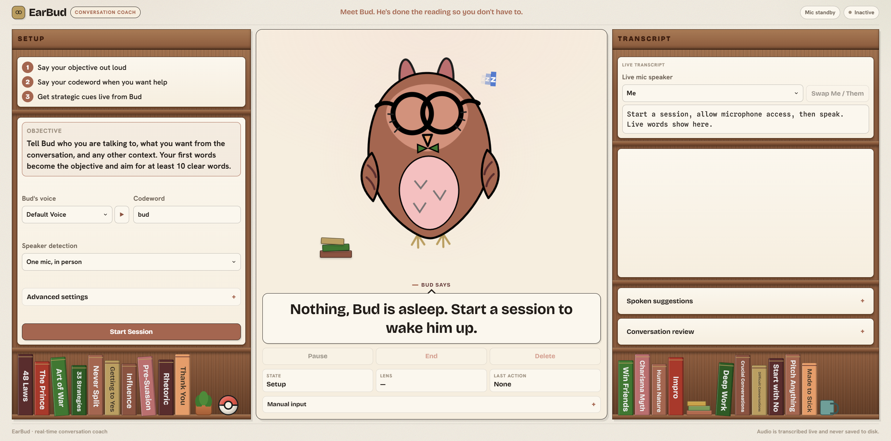
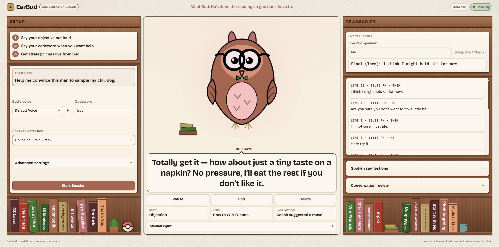

# EarBud

EarBud is a live conversation coach which listens to your conversations and helps you achieve your goals.

EarBud is your personal coach who discreetly guides your speech and helps you toward your objective during your conversations. It is a browser-based application that can run on both phone and desktop.

Before speaking to Bud, your personal coach, you can choose your codeword, conversation type, Bud's suggestions, and even Bud's voice. Next, connect your earbuds or wireless audio device, start a session, and speak your objective to Bud who will listen to it and give guidance based on it. Say your codeword when you want help, and Bud will chime in and give suggestions based on the current conversation history and your objective.

EarBud is for all people, whether you are a student or a working professional. EarBud is there for all conversational tasks such as asking for a grade bump, pitching an idea to an investor, or making plans and forming bonds with those around you, as everyone forgets things and could use a coach on their side. EarBud takes the anxiety and the second guessing over how to phrase things away, leaving you free to focus on what matters, getting your ideas across and achieving your goals.

---

## Motivation

Imagine this, you're talking to your boss about a crucially needed raise. You explain why you want the raise and how it would help you. Your boss then asks why you should get this raise. Your mind goes blank. You don't get the raise. With Bud on your side he would have suggested you name a specific accomplishment you have recently done and how it benefited the company. Your boss then sees the direct impact of your work and can understand how your contributions merited a raise. You get the raise. With Bud on your side, you get things done.

Relationships dictate our life and shape it in unimaginable ways. If you did not connect with that one teacher in high school, then you might not have gotten that recommendation letter, gotten into that prestigious college, gotten that high-paying job, and ultimately live a successful and desirable life. Bud guides you at one of the most essential aspects of life, human communication.

With earbuds, powerful computers, and fast and effective models which can reason in a live chat, it is finally possible to get an effective, fast, and accessible personal conversation coach like Bud.

Nothing out there helps while it is happening. Notes are passive, summarizers only look back, and you cannot bring a human coach into the room with you. Being always there for you, Bud blends all the aspects of a good coach, speed, reasoning, and dependability.

---

## Screenshots & Demo

**Watch the demo** (click to play on YouTube)

[](https://youtu.be/PHzw6_PkUc8)

**Bud waiting for a session**

Pick your voice, codeword, and conversation type, then say your objective to wake Bud up.



**A suggestion mid-conversation**

Bud reads the running transcript and chimes in with a short move, plus the tactic behind it.




---

## Features

Bud encompasses all the features of a great coach and more:
- Live transcription with Me / Them speaker labeling
- Transcription modes for all types of conversations (in person, online call, and manual).
- Codeword to start and stop coaching hands free.
- Customizability of voice, suggestions, and codeword allow for a personalized coach, perfectly suited for your needs
- Short, convenient suggestions grounded in your objective and reasoning through the conversation.
- A comprehensive library of persuasion and negotiation tactics behind the advice.
- An end of session review of how the conversation went.
- Runs as one small Node app, deploys as a single service.

---

## Tech Stack

EarBud is a small Node.js app that serves the website and runs the backend along with two AI services that handle the listening and the coaching.

**The browser app**
- JavaScript, HTML, and CSS, with no framework. The whole frontend lives in `index.html`, `styles.css`, and `app.js`.
- `pcm-worklet.js` is an audio worklet that takes the raw microphone (and, on calls, a shared tab's audio) and converts it into 16 kHz PCM16, which is the format the transcription service expects.
- If no AssemblyAI key is set, it falls back to the browser's built in speech recognition so you can still try it out.

**The server**
- Node.js 22 with Express serves the static files and handles the API routes.
- A WebSocket endpoint at `/api/diarize-stream` takes the live audio from the browser and sends it to AssemblyAI, which sends the text back as people talk.

**The AI parts**
- AssemblyAI does the listening. It takes in the audio, transcribes it, and labels each part as Me or Them using its streaming model (`u3-rt-pro`, also called Universal-3 Pro).
- OpenAI is the coach. The app uses `gpt-5-mini` by default and can switch to `gpt-5-nano`. It reads the running conversation along with the sources such as the Art of War and other persuasive books and chimes in with a suggestion.

**Hosting**
- EarBud is deployed to Render as a single service using the included `render.yaml`. The Node server hosts both the frontend and the backend, so there is no separate static host to set up. Render was used because EarBud's live transcription runs over a WebSocket that has to stay open for the whole session. Serverless hosts, which are built around short one off requests, would cut it off.

---

## How It Works

Before a session starts, you can set a few things:

- Bud's response vs. reasoning levels
- Bud's spoken suggestion voice, speed, and volume
- The type of conversation
- A codeword to trigger coaching

When the session begins you say your objective out loud. EarBud uses those first words two ways. It reads them as your goal, and it uses your voice to calibrate so it can tell you apart from the other speakers.

Once you are in the conversation, say your codeword whenever you want help. EarBud reads past and current conversation history in order to grasp the conversation and provide the most effective suggestions to achieve the objective. Say your codeword again to pause coaching.

Each new line of transcript can trigger a call to the `/api/coach` route. The server builds a prompt from your objective, the codeword, and the last 16 lines of the labeled transcript, then asks OpenAI for the next move. The model replies in a strict JSON shape with these fields:

- `state`: one of Opening, Exploring, Objection, Reframe, Ask, Closing, Reached, Blocked, Listen, Boundary
- `shouldChimeIn`: whether there is anything worth saying right now
- `suggestion`: one short sentence, capped around 15 words, written to be easy to say out loud
- `followUp`: a concrete next step to remember, or null
- `lens`: the tactic the suggestion is based on (the book it came from, or None)

A suggestion might read like:

> "Mention a specific result your work produced and how it benefited the company."

Suggestions stay short on purpose so you can glance at them mid conversation. If EarBud has nothing useful to add, it stays quiet.

If the OpenAI call fails, the server falls back to a simple local suggestion built in `coachLogic.js` so the session keeps running.

When the session ends, the `/api/review` route sends the full transcript (capped to conserve tokens) back to OpenAI for a recap. The review comes back as an outcome (Achieved, Partially achieved, Not achieved, or Inconclusive), a short summary, and three short lists: what worked, what to improve, and next steps. The review runs once and is not time sensitive, so the model can reason for longer and create a more comprehensive review.

---

## Transcription Modes

Each session runs in one of three modes.

### In Person (single microphone)

One microphone picks up everyone in the room, and AssemblyAI's speaker diarization works out who is talking.

The first voice it hears is labeled **Me** and everyone else is labeled **Them**. If the labels come out backwards you can swap them with one click.

This mode works best with AirPods or a laptop mic where a single device hears the whole conversation. Extra turn taking logic in `coachLogic.js` and `sessionLogic.js` helps with short replies that are hard to attribute. The server also tunes AssemblyAI's turn endpointing (higher confidence threshold and longer silence windows) so it waits for a full thought instead of cutting people off mid sentence.

### Online Calls

For virtual meetings your microphone is **Me** and the system audio or a shared browser tab is **Them**.

Each source is already separate, so there is one WebSocket per source and diarization is turned off. The server passes `diarize=0`, which disables AssemblyAI speaker labels, and the client labels each line by which socket it came in on.

### Manual Mode

Type lines yourself, or use the browser's built in speech recognition, and pick the speaker from a dropdown.

This one is useful for testing and development, and it works with no AssemblyAI key set as it does not need diarization or transcription.

---

## Coaching Engine

The coaching lives in `coachingPrinciples.js`, a library of persuasion, negotiation, and communication tactics.

The tactics are distilled from sources like:

- *Never Split the Difference*
- *Influence*
- *The Art of War*
- *The 48 Laws of Power*
- *Aristotle's Rhetoric*

Each one is a short tactical principle labeled for the situations it fits. The full library is sent in the system prompt, and for each suggestion the model picks the single most relevant tactic and names it in the `lens` field. The tactics are reasoning influences, not scripts, so the model never quotes or imitates book text.

There are guardrails, meaning before every coaching call the server scans your objective and your latest line with `findSafetyIssue`. If the goal involves harming, defrauding, or exploiting anyone, EarBud returns a Boundary state and redirects instead of helping. The model is told to stay truthful and to not make up facts or lie. It is also told to only advise **Me**, never the other person. The goal is better communication, not deception or manipulation.

---

## Project Structure

```text
EarBud/
  index.html             The whole UI
  styles.css             Styles, including Bud and the bookshelves
  app.js                 Frontend logic: audio capture, sessions, UI
  pcm-worklet.js         Audio worklet that outputs 16 kHz PCM16
  server.js              Express server, WebSocket proxy, coach + review routes
  coachingPrinciples.js  The tactics library
  coachLogic.js          Speaker labeling, safety checks, local fallback
  sessionLogic.js        Session and turn taking helpers
  render.yaml            Render deployment config
  .env.example           Template for your API keys and settings
  test/                  Node test files
  docs/                  Architecture, privacy, roadmap, and design notes
```

---

## Running Locally

Install dependencies:

```powershell
npm install
```

Copy `.env.example` to `.env` and add your keys:

- `OPENAI_API_KEY` powers the coaching and the review.
- `ASSEMBLYAI_API_KEY` powers live transcription.

Get keys from:

- https://platform.openai.com/api-keys
- https://www.assemblyai.com/app

Start the app:

```powershell
npm start
```

Then open:

```text
http://localhost:3000
```

For development with auto reload on file changes:

```powershell
npm run dev
```

Run the tests anytime:

```powershell
npm test
```

If you start it with no `OPENAI_API_KEY` the coach is disabled. No `ASSEMBLYAI_API_KEY` also means live transcription is disabled, but you can still use manual mode. The startup logs tell you which services came up.

---

## Configuration

All settings are read from the environment (use `.env` locally). The model and reasoning effort can also be changed from the UI during a session.

| Variable | What it does | Default |
| --- | --- | --- |
| `OPENAI_API_KEY` | Enables the coach and the review | none |
| `ASSEMBLYAI_API_KEY` | Enables live transcription | none |
| `OPENAI_MODEL` | Coach model, `gpt-5-mini` or `gpt-5-nano` | `gpt-5-mini` |
| `OPENAI_REASONING_EFFORT` | How hard the coach thinks: `minimal`, `low`, `medium`, `high` | `minimal` |
| `ASSEMBLYAI_MODEL` | Streaming speech model | `u3-rt-pro` |
| `ASSEMBLYAI_MAX_SPEAKERS` | Max speakers in one mic mode | `2` |
| `ASSEMBLYAI_EOT_CONFIDENCE` | End of turn confidence threshold | `0.8` |
| `ASSEMBLYAI_MIN_SILENCE` | Min silence (ms) before a turn can end | `1000` |
| `ASSEMBLYAI_MAX_SILENCE` | Max silence (ms) before a turn ends | `3000` |
| `ASSEMBLYAI_VAD_THRESHOLD` | Voice detection threshold for noisy rooms (0 to 1) | unset |
| `ASSEMBLYAI_SHORT_TURN_WORDS` | Word count under which a turn is treated as uncertain | `1` |
| `ASSEMBLYAI_DEBUG` | Logs each turn to the server console | unset |
| `PORT` | Port the server listens on | `3000` |

The deployed `render.yaml` lowers only the max turn silence (`ASSEMBLYAI_MAX_SILENCE=2000`, vs the `3000` code default) so the coach reacts a little faster at the end of a turn; `ASSEMBLYAI_EOT_CONFIDENCE` (`0.8`) and `ASSEMBLYAI_MIN_SILENCE` (`1000`) match the code defaults above.

---

## Deploying on Render

The repo includes a `render.yaml`, so the whole app deploys as a single Render service. The Node server hosts both the frontend and the backend, so there is no separate static host to set up.

Steps:

1. Push the repo to GitHub, GitLab, or Bitbucket.
2. Create a new Render Blueprint from the repo.
3. Add your `OPENAI_API_KEY` and `ASSEMBLYAI_API_KEY`.
4. Deploy.

The service:

- Builds with `npm ci`
- Starts with `npm start`
- Runs on Node 22
- Uses `/api/health` for health checks
- Picks up the `PORT` Render provides

The free tier is fine for demos. It sleeps when idle, so the first visit after a while takes a few seconds to wake up.

---

## Privacy

EarBud processes live conversation audio, so privacy must be treated seriously.

The prototype:

- Keeps audio in memory only and does not save audio files
- Keeps transcript and goal text out of the server logs (errors log a message only)
- Lets you delete session data from the interface

For the full write up, see `docs/privacy-and-safety.md`.

---

> Built with the help of Claude Code and Codex.

